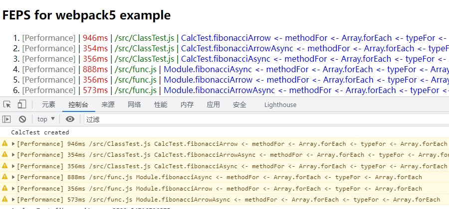

[][npm-url]

# @lzwme/feps-webpack-plugin

[![NPM version][npm-badge]][npm-url]
[![node version][node-badge]][node-url]
[![npm download][download-badge]][download-url]
[![GitHub issues][issues-badge]][issues-url]
[![GitHub forks][forks-badge]][forks-url]
[![GitHub stars][stars-badge]][stars-url]
[![minzipped size][bundlephobia-badge]][bundlephobia-url]

[简体中文-README_zh-CN.md](./README_zh-CN.md)

**Function execution performance statistics**

This plug-in is used for function execution performance statistics. It calculates the execution time by injecting statistical code and finds slow functions.

## Getting Started

To begin, you'll need to install `@lzwme/feps-webpack-plugin`. For example:

```console
pnpm install -D @lzwme/feps-webpack-plugin
```

Then add the plugin to your `webpack` config. For example:

**webpack.config.js**

```js
// webpack.config.js

const path = require('path');
const webpack = require('webpack');
const FEPSPlugin = require('@lzwme/feps-webpack-plugin');

module.exports = {
  plugins: [
    new FEPSPlugin({
      // debug: true,
      // disabled: false,
      rootDir: __dirname,
      timeLimit: 50,
      logger: 'console.warn', // 'globalThis.logger.report',
      include: [/\.(tsx?|jsx?)$/],
      exclude: ['node_modules', /\.ignore\./],
    }),
  ],
};
```

## Options

|     Name    |    Type    |     Default      | Description                                      |
| :---------: | :--------: | :--------------: | :----------------------------------------------- |
| `debug`     | `{boolean}`| `false`          | debug for print details info |
| `disabled`  | `{boolean}`| `false`          | Disable the plugin |
| `rootDir`   | `{String}` | `process.cwd()`  | Project root directory |
| `logger`    | `{String}` | `console.warn`   | Specifies the global method for printing slow function log information |
| `timeLimit` | `{Number}` | `50`             | Threshold value for the execution time of slow functions.<br> If the execution time is greater than this value, the global method specified by `options.logger` will be called |
| `include`   | `{(String \| RegExp)[]}` |  `[/(jsx?\|tsx?)$/]`  | Specifies a list of patterns that match files to be included in compilation |
| `exclude`   | `{(String \| RegExp)[]}` |  `['node_modules']`  | Specifies a list of patterns that match files to be excluded from compilation |
| `excludeNodeType` | `{AnyNode[]}` | `[]`   | Specifies a list of ast node types that to be excluded |

## Examples

- [webpack5-example](https://github.com/lzwme/feps-webpack-plugin/tree/main/examples/webpack5-example/)


!


!

## Development

```bash
git clone https://github.com/lzwme/feps-webpack-plugin.git
pnpm install

# start for examples/webpack5-example
pnpm run dev
# enable cache by filesystem
pnpm run dev --cache
# first delete the dist and cache directories
pnpm run dev --reset
```

## License

`@lzwme/feps-webpack-plugin` is released under the MIT license.

该插件由[志文工作室](https://lzw.me)开发和维护。


[stars-badge]: https://img.shields.io/github/stars/lzwme/feps-webpack-plugin.svg
[stars-url]: https://github.com/lzwme/feps-webpack-plugin/stargazers
[forks-badge]: https://img.shields.io/github/forks/lzwme/feps-webpack-plugin.svg
[forks-url]: https://github.com/lzwme/feps-webpack-plugin/network
[issues-badge]: https://img.shields.io/github/issues/lzwme/feps-webpack-plugin.svg
[issues-url]: https://github.com/lzwme/feps-webpack-plugin/issues
[npm-badge]: https://img.shields.io/npm/v/@lzwme/feps-webpack-plugin.svg?style=flat-square
[npm-url]: https://npmjs.org/package/@lzwme/feps-webpack-plugin
[node-badge]: https://img.shields.io/badge/node.js-%3E=_14.0.0-green.svg?style=flat-square
[node-url]: https://nodejs.org/download/
[download-badge]: https://img.shields.io/npm/dm/@lzwme/feps-webpack-plugin.svg?style=flat-square
[download-url]: https://npmjs.org/package/@lzwme/feps-webpack-plugin
[bundlephobia-url]: https://bundlephobia.com/result?p=@lzwme/feps-webpack-plugin@latest
[bundlephobia-badge]: https://badgen.net/bundlephobia/minzip/@lzwme/feps-webpack-plugin@latest
